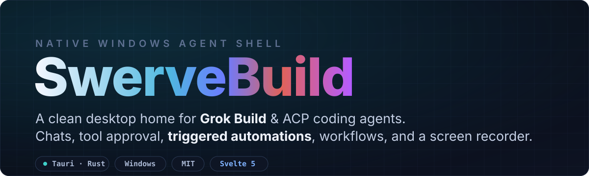
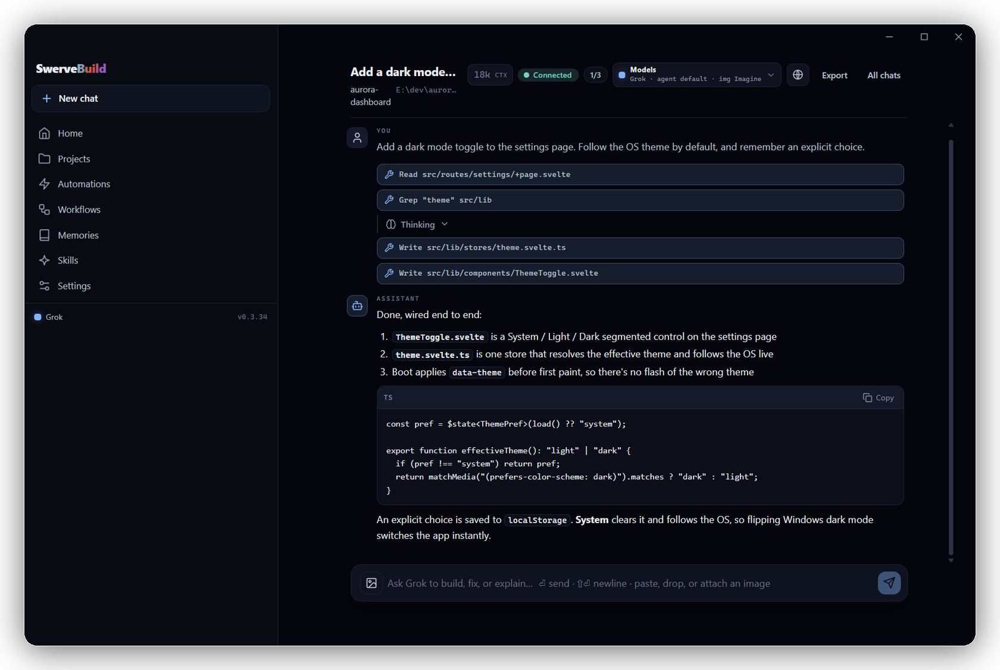
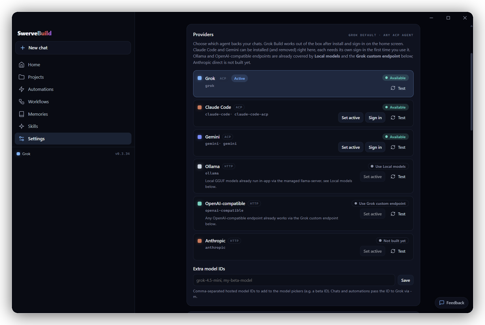

<p align="center">
  
</p>

<p align="center">
  
  
  
  <a href="https://github.com/Swervebytes/SwerveBuild/releases"></a>
</p>

<p align="center">
  
</p>

---

## Why Swerve Build

[Grok Build](https://github.com/xai-org/grok-build) is open source (Apache-2.0), and Swerve Build is the calm, auditable way to run it on Windows. Scope work to a project, watch **every tool call stream through an approval gate**, let agents **run themselves** on a schedule, and record your screen with desktop audio, all in one native app with no browser tab.

Prefer to keep your code on your machine? Point Grok at your own [local or self-hosted endpoint](#run-grok-against-your-own-endpoint), or run [local GGUF models](#local-models). Neither needs an xAI sign-in.

## Highlights

- **Project chats.** Folder-scoped conversations with ACP streaming, a tool-approval UI, inline images and video, and an honest context bar (real token counts from the agent, or a dash when the agent reports nothing, never invented). Up to 3 run at once.
- **Any agent, managed in-app.** Grok works out of the box. Claude Code and Gemini **install, sign in, and uninstall** from Settings.
- **Automations.** Headless Grok runs on a schedule, a git commit, a file change, or on demand. Read-only by default.
- **Workflows.** A visual node-graph engine: triggers, requests, transforms, sandboxed code, and agent turns.
- **Screen recorder.** Real display capture to H.264 MP4 (NVENC, software fallback) **with desktop audio**.
- **Local models.** An app-managed `llama-server` (pinned and checksummed) with a live VRAM meter.
- **Opt-in agent surfaces.** Let an agent run terminal commands, drive a debug browser, or drive Swerve Build's own UI. Each sits behind its own explicit, off-by-default grant.

## Automations: turn any agent task into a rule

<p align="center">
  
</p>

A **trigger** (a schedule, a new commit on a branch, a changed file, or a manual **Run now**) fires a headless Grok run against a project.

- **Safe by default.** Every automation starts in **shadow mode**: a read-only tool set enforced in the app, so a background agent can read and reason but never touch your files. Network tools are off by default too. *(Write mode is gated behind a later build.)*
- **DST-safe schedules**, **auditable** run transcripts under `~/.swervebuild/runs/`, and **composable** runs that chain one rule's output into another's prompt.
- Start from a recipe (*Doc-drift check*, *Project summary*, *Dependency digest*) and tweak from there. Automations run on Grok, and the app says so when another provider is active.

## Bring your own agent

<p align="center">
  
</p>

Open **Settings → Providers**. Claude Code and Gemini are installed *by the app* at pinned versions, signed in via **each agent's own flow** (a button opens it; Swerve Build never sees your credentials), and removed with a confirmation that names the exact command.

| Provider | How to enable |
|----------|---------------|
| **Grok** (default) | Install and sign in on the home screen |
| **Claude Code** | Settings → Providers → **Install**, then **Sign in** (`claude /login` opens in a terminal) |
| **Gemini** | Settings → Providers → **Install**, then **Sign in** (Google OAuth in your browser) |
| **Ollama** | Already covered. Use **Local models** (managed llama-server) |
| **OpenAI-compatible** | Already covered. Use the **Grok custom endpoint** below |
| **Anthropic API (direct)** | Not built yet |

## Install

No Node.js or Rust required for end users.

1. Download the latest **Windows installer** from [Releases](https://github.com/Swervebytes/SwerveBuild/releases) (`Swerve Build_<version>_x64-setup.exe`).
2. Run it and open **Swerve Build**.
3. On the home screen, click **Install Grok Build** (installs the official Grok CLI, pinned and checksum-verified, to `~/.grok/`).
4. Click **Sign In** and finish OAuth in your browser.
5. Open **Projects**, add a folder, and start a chat, or head to **Automations** and start from a recipe.

### The Windows SmartScreen warning (expected)

Swerve Build ships **unsigned**. There is no code-signing certificate, so the first run of a new release shows *"Windows protected your PC"*. Click **More info → Run anyway**. Your browser may likewise flag the download as "not commonly downloaded". This is expected for every release, because unsigned reputation attaches to each file's hash.

**Verify what you downloaded** instead of trusting the warning away. Every release publishes a SHA-256 checksum next to the installer:

```powershell
Get-FileHash '.\Swerve Build_<version>_x64-setup.exe' -Algorithm SHA256
```

Compare against the value on the release page. Only download from [GitHub Releases](https://github.com/Swervebytes/SwerveBuild/releases). There is no other distribution channel.

## Run Grok against your own endpoint

In **Settings → Custom endpoint (advanced)**, point Grok Build at any OpenAI-compatible inference: local (Ollama, llama.cpp), self-hosted, or a gateway. Swerve writes a managed `[model.swerve-endpoint]` block to `~/.grok/config.toml` (backing the file up first) and routes Grok's default model to it while enabled. The endpoint's API key is stored in the **Windows Credential Manager**, never in a plaintext file and never written into Grok's `config.toml`, then injected into Grok's environment at launch. Because it satisfies Grok's own auth, **no xAI sign-in is required**, so your code can stay entirely on your machine. Both chats and Automations follow the endpoint.

## Local models

**Settings → Local models** manages a pinned, checksum-verified `llama-server`: register GGUF files and they appear in every model picker (chats and automations) with a live VRAM meter while loaded. Chats and background automations lease the server cooperatively, so one can't yank a model out from under the other.

## Privacy: what leaves your machine

Swerve Build itself sends **no telemetry, no analytics, no crash reports**. Network traffic happens only when:

- **You chat.** Prompts and project context go to the active provider's backend (xAI for Grok, Anthropic for Claude Code, Google for Gemini), unless you route Grok to a local endpoint or use local models, in which case inference stays on your machine.
- **An agent uses a network tool.** Web search or fetch, or image generation via xAI Imagine. Automations run with network tools **off** by default; enabling them is per-rule and explicit.
- **You install something.** The Grok CLI, FFmpeg, and llama-server are fetched from pinned URLs and SHA-256-verified; installing Claude Code or Gemini runs npm against the public registry.
- **You use the browser pane**, which loads whatever URL you (or a granted agent) navigate to.

Secrets (the custom-endpoint API key and the local server token) live in the **Windows Credential Manager**, not in JSON files, and no UI or agent-reachable command can read them back.

## Uninstall

The uninstaller removes the app but deliberately leaves your data:

- `~/.swervebuild/` holds chats, projects, automations, recordings, and settings
- `~/.grok/` holds the Grok CLI, its auth, memory, and skills

To remove everything: uninstall, delete those two folders, and clear the `SwerveBuild` entries in Windows Credential Manager (`cmdkey /list` shows them).

## Data locations

| Path | Purpose |
|------|---------|
| `~/.swervebuild/data.json` | Projects, chats, messages |
| `~/.swervebuild/automations.json` | Automation definitions |
| `~/.swervebuild/runs/` | Per-run transcripts |
| `~/.swervebuild/attachments/` | Pasted images, captured stills, recorded clips (budgeted; oldest pruned) |
| `~/.swervebuild/providers.json` | Provider preferences, with **no secrets** (those live in Credential Manager) |
| `~/.grok/` | Grok CLI (auth, skills, memory, sessions) |

Existing `~/.swervegrok/` data is migrated to `~/.swervebuild/` on first launch.

## Support policy

Windows 10/11 x64, NVIDIA-first for the media features (the recorder falls back to software encoding without NVENC). Personal-first project, best-effort support via GitHub issues. See [CHANGELOG.md](CHANGELOG.md) for what changed per release.

## Develop

**Prerequisites:** [Node.js](https://nodejs.org/) 18+, [Rust](https://www.rust-lang.org/tools/install) (`rustup`), and the [Tauri Windows prerequisites](https://tauri.app/start/prerequisites/) (WebView2 and MSVC build tools).

```powershell
git clone https://github.com/Swervebytes/SwerveBuild.git
cd SwerveBuild
npm install
npm run tauri dev
```

> Do **not** double-click `target/debug/*.exe` directly. Dev mode needs the Vite server.

| Script | What it does |
|--------|--------------|
| `npm run tauri dev` | Full desktop app with hot reload |
| `npm run check` | Type-check Svelte |
| `npm run test:unit` | Vitest unit tests |
| `cargo test --workspace` (in `src-tauri/`) | Rust tests |
| `npm run test:e2e` | CLI tests (MCP always; ACP if grok and `SWERVE_E2E_CWD` set) |
| `npm run smoke:session` | Live drive of the installed app (MCP/CDP) |
| `npm run release` | Production Windows installer |

The release output lands at `src-tauri/target/release/bundle/nsis/Swerve Build_<version>_x64-setup.exe`. For a local overinstall: `npm run install:local`.

## Stack and structure

[Tauri 2](https://tauri.app/) native shell, [SvelteKit](https://svelte.dev/) and Svelte 5 frontend, Rust backend.

```
src/                    SvelteKit UI (routes, components, stores)
src-tauri/src/
  acp.rs                Multi-chat ACP session pool
  jobs.rs               Automation runner + scheduler
  providers.rs          Multi-agent provider registry
  provider_auth.rs      Agent sign-in surface (ACP authenticate / own flows)
  secrets.rs            OS keystore seam (Windows Credential Manager)
  media_worker.rs       Supervised out-of-process capture/encode
  local_llm.rs          Managed llama-server + VRAM arbitration
  live.rs               Go-live approval tier (streaming lands in a future release)
  store.rs / paths.rs   Atomic persistence + data dir
  bin/                  swervebuild-mcp stdio server, media worker, workflows
crates/swerve-workflows Node-graph workflow engine (Rust + QuickJS)
```

## Contributing

Contributions welcome. Keep the UI clean and dependencies minimal, and open an issue before large architectural changes. Maintainers: read [`.github/REPOSITORY_POLICY.md`](.github/REPOSITORY_POLICY.md) before pushing or cutting a release. Dependabot PRs feed a deliberate upgrade ritual and are never auto-merged.

**License:** [MIT](LICENSE)
