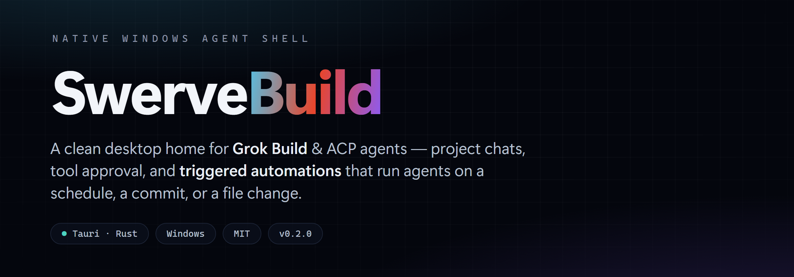
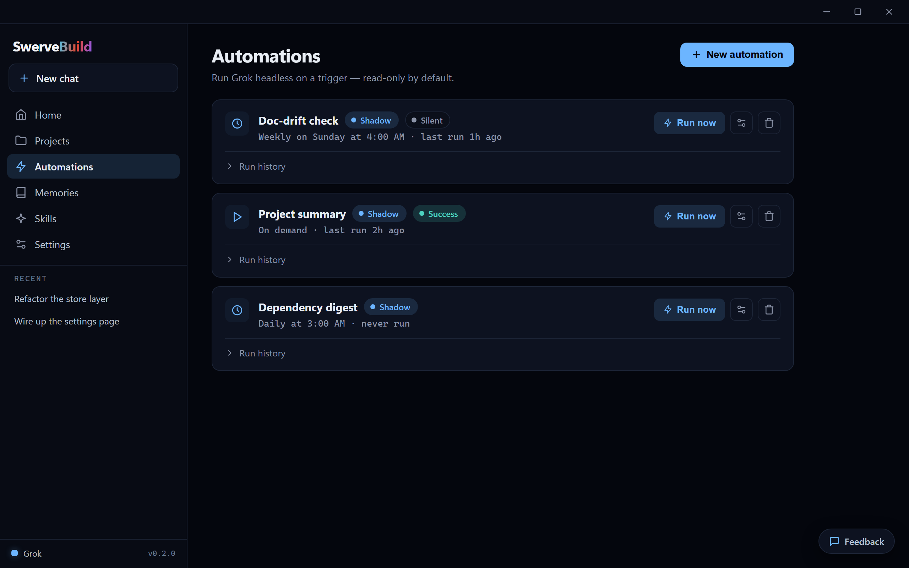

<p align="center">
  
</p>

<p align="center">
  A clean desktop home for <a href="https://github.com/xai-org/grok-build">Grok Build</a> &amp; ACP coding agents —<br/>
  project chats, tool approval, memories, skills, and <b>triggered automations</b>, in one native Windows shell.
</p>

<p align="center">
  
  
  
  
</p>

---

## Why Swerve Build

Grok Build is now [open source](https://github.com/xai-org/grok-build) (Apache-2.0) — and Swerve Build is the calm, auditable way to run it on Windows. Scope work to a project, watch every tool call stream through an approval gate, keep memories and skills close, and — new in **v0.2.0** — let agents **run themselves** on a schedule, a commit, or a file change. Want your code to stay on your machine? Point Grok at your own [local or self-hosted endpoint](#run-grok-against-your-own-endpoint) — no xAI sign-in, nothing leaves the box.

## Highlights

|  |  |
|---|---|
| **Project chats** | Folder-scoped conversations with ACP streaming, image paste, and a tool-approval UI. Up to 3 run concurrently. |
| **Automations** | Trigger headless Grok runs on a schedule, git commit, file change, or on demand — read-only by default. |
| **Multi-provider** | Grok works out of the box; drop in Claude Code or Gemini by putting their CLI on your PATH. |
| **Your own endpoint** | Point Grok at local or self-hosted OpenAI-compatible inference — your code never leaves the machine. |
| **Memories &amp; Skills** | Edit Grok's memory and browse installed skills without leaving the app. |
| **MCP sidecar** | Exposes your projects, chats, and automations to agents *inside* chat. |

## Automations

<p align="center">
  
</p>

Turn any repeatable agent task into a rule. A **trigger** — a schedule, a new commit on a branch, a changed file, or a manual **Run now** — fires a headless Grok run against a project.

- **Safe by default.** Every automation starts in **shadow mode**: a read-only tool set enforced in the app itself, so a background agent can read and reason but never touch your files. *(Write mode is gated behind a later build.)*
- **Fully auditable.** Runs stream live and are saved as durable transcripts under `~/.swervebuild/runs/`.
- **Composable.** Chain one automation's output into another's prompt.
- **Visual.** Flip the Automations page to **Map view** to see your whole fleet as a live graph.

Start from a one-click recipe — *Project summary*, *Doc-drift check*, *Find loose ends*, *Review-on-change* — and tweak from there. Automations run while Swerve Build is open.

## Install

No Node.js or Rust required for end users.

1. Download the latest **Windows installer** from [Releases](https://github.com/Swervebytes/SwerveBuild/releases) (`Swerve Build_*_x64-setup.exe`) — prefer **v0.3.0+**.
2. Run it and open **Swerve Build**.
3. On the home screen, click **Install Grok Build** (installs the official Grok CLI to `~/.grok/`).
4. Click **Sign In** and finish OAuth in your browser.
5. Open **Projects**, add a folder, and start a chat — or head to **Automations** and start from a recipe.

### Using other agents

Open **Settings → Providers** and pick an available agent. The home screen shows your active provider and whether it's ready.

| Provider | How to enable |
|----------|---------------|
| **Grok** (default) | Install + sign in on the home screen |
| **Claude Code** | Install [`claude-code-acp`](https://www.npmjs.com/package/claude-code-acp) and put it on your PATH |
| **Gemini** | Install the Gemini CLI and put `gemini` on your PATH |
| **Ollama / OpenAI / Anthropic** | Listed as designed — direct HTTP chat isn't spawnable yet |

### Run Grok against your own endpoint

In **Settings → Custom endpoint (advanced)**, point Grok Build at any OpenAI-compatible inference — local (Ollama, llama.cpp), self-hosted, or a gateway. Swerve writes a managed `[model.swerve-endpoint]` block to `~/.grok/config.toml` (backing the file up first) and routes Grok's default model to it while enabled. The endpoint's API key is stored locally in `~/.swervebuild/providers.json` and injected into Grok's environment at launch — **never written into Grok's `config.toml`**; because it satisfies Grok's own auth, **no xAI sign-in is required** — so your code can stay entirely on your machine. Both chats and Automations follow the endpoint. Turn routing off to return to xAI's hosted models.

## Develop

**Prerequisites:** [Node.js](https://nodejs.org/) 18+, [Rust](https://www.rust-lang.org/tools/install) (`rustup`), and the [Tauri Windows prerequisites](https://tauri.app/start/prerequisites/) (WebView2 + MSVC build tools).

```powershell
git clone https://github.com/Swervebytes/SwerveBuild.git
cd SwerveBuild
npm install
npm run tauri dev
```

> Do **not** double-click `target/debug/*.exe` directly — dev mode needs the Vite server.

| Script | What it does |
|--------|--------------|
| `npm run tauri dev` | Full desktop app with hot reload |
| `npm run dev` | Frontend only, in a browser |
| `npm run check` | Type-check Svelte |
| `npm run test:e2e` | CLI tests (MCP always; ACP if grok + `SWERVE_E2E_CWD` set) |
| `npm run release` | Production Windows installer |

The release output lands at `src-tauri/target/release/bundle/nsis/Swerve Build_<version>_x64-setup.exe`; upload the `*-setup.exe` to GitHub Releases. For a local overinstall after a session: `npm run install:local`.

## Data locations

| Path | Purpose |
|------|---------|
| `~/.swervebuild/data.json` | Projects, chats, messages |
| `~/.swervebuild/automations.json` | Automation definitions |
| `~/.swervebuild/runs/` | Per-run transcripts |
| `~/.swervebuild/providers.json` | Active provider preference |
| `~/.grok/` | Grok CLI (auth, skills, memory, sessions) |

Existing `~/.swervegrok/` data is migrated to `~/.swervebuild/` on first launch.

## Stack &amp; structure

[Tauri 2](https://tauri.app/) native shell · [SvelteKit](https://svelte.dev/) + Svelte 5 frontend · Rust backend (ACP session pool, the automation runner, persistence, and the MCP sidecar).

```
src/                    SvelteKit UI (routes, components, stores)
src-tauri/src/
  acp.rs                Multi-chat ACP session pool
  jobs.rs               Automation runner + scheduler
  providers.rs          Multi-agent provider registry
  store.rs / paths.rs   Atomic persistence + data dir
  bin/                  swervebuild-mcp stdio server
```

## Contributing

Contributions welcome — keep the UI clean and dependencies minimal, and open an issue before large architectural changes. Maintainers: read [`.github/REPOSITORY_POLICY.md`](.github/REPOSITORY_POLICY.md) before pushing or cutting a release. Dependabot handles npm and Cargo updates weekly.

**License:** [MIT](LICENSE)
